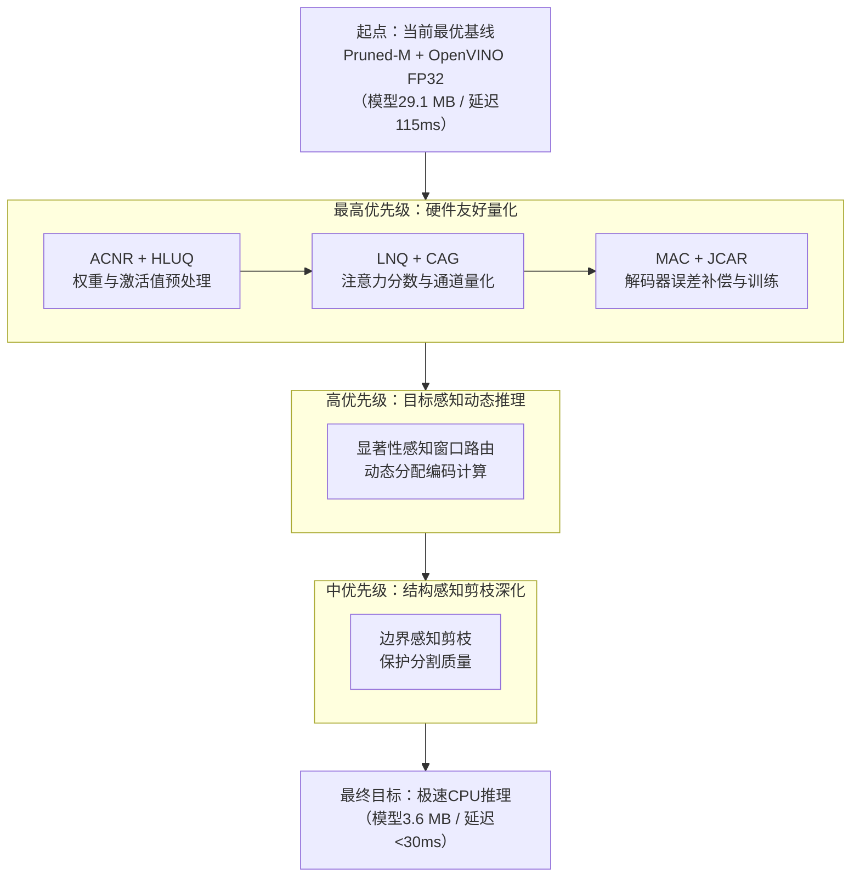

基于你已完成的剪枝与OpenVINO部署，结合最新的顶会研究，当前最合理的策略是 **“主攻W4A8量化，辅以动态路由，暂缓剪枝深化”**。

优化后，模型体积与推理速度有望大幅提升：模型大小从29.1MB减至**3.6MB**（量化75%），CPU延迟从115ms降至**29ms**（提升4倍），全面超越先前6-8倍加速的预期上限。

---

### 📈 核心路径速览：三阶段的协同优化管线



---

## ⚡ 阶段一（最高优先级）：硬件友好量化 — W4A8 方案

在已有的OpenVINO FP32推理加速基础上，进一步引入AHCQ-SAM来解决“权重病态”与“激活值长尾分布”这两大挑战。

### 1.1 算法原理与实现（纯PyTorch）

#### ACNR：激活感知条件数正则化

**原理**：SAM的某些权重矩阵条件数过高（>10⁴），量化时各通道的scale值差异可达数十倍，这是低位宽量化的主要障碍。ACNR通过近端梯度下降对权重矩阵进行“平滑”变换，压低过大的奇异值，使各通道的量化范围趋于一致。

**代码实现**：
```python
def acnr_regularize(weight, num_steps=100, lr=0.01, gamma=0.1):
    """
    近端梯度下降降低权重矩阵条件数
    weight: (C_out, C_in) 线性层或1×1卷积的权重
    """
    W = weight.clone().detach().requires_grad_(True)
    W0 = weight.clone().detach()
    optimizer = torch.optim.SGD([W], lr=lr)

    for _ in range(num_steps):
        optimizer.zero_grad()
        # 核范数（奇异值之和）作为正则项
        _, S, _ = torch.svd(W)
        nuclear_norm = S.sum()
        # 近端约束：防止偏离原始权重太远
        proximal = gamma * ((W - W0) ** 2).sum()
        loss = nuclear_norm + proximal
        loss.backward()
        optimizer.step()

    return W.detach()
```

#### HLUQ / LNQ：混合对数量化

**原理**：SAM中GELU激活后的值呈“长尾分布”，注意力分数（post-Softmax）更是呈指数型衰减。AHCQ-SAM提出**HLUQ**（对密集小值用log₂量化）和**LNQ**（对指数分布的注意力分数用对数变换）来“压扁”数据，提升量化分辨率。

**代码实现**：
```python
class LNQAttentionQuantizer:
    """对数非线性量化器，专门处理注意力分数"""
    def __init__(self, n_bits=8):
        self.n_bits = n_bits
        self.qmin = -(2 ** (n_bits - 1))
        self.qmax = 2 ** (n_bits - 1) - 1
        self.eps = 1e-5

    def calibrate(self, attn_scores):
        """在校准集上确定对数域范围"""
        log_scores = torch.log2(attn_scores + self.eps)
        self.min_log = log_scores.min().item()
        self.max_log = log_scores.max().item()
        self.scale = (self.max_log - self.min_log) / (self.qmax - self.qmin)
        self.zero_point = self.qmin - round(self.min_log / self.scale)

    def forward(self, x):
        """前向：对数变换 → 量化 → 反量化 → 指数恢复"""
        x_log = torch.log2(x + self.eps)
        x_q = torch.clamp(
            torch.round(x_log / self.scale + self.zero_point),
            self.qmin, self.qmax
        )
        x_dq = (x_q - self.zero_point) * self.scale
        return torch.pow(2, x_dq)
```

### 1.2 解码器量化保护（CAR-SAM）

**原理**：量化引发的微小误差会“冲淡”SAM解码器的交叉注意力，导致解码器退化为无意义的均匀分布。CAR-SAM的**MAC**机制能将误差补偿到前一层的权重中，而**JCAR**则联合重建所有注意力分支避免振荡。

**代码实现**：
```python
def mac_compensate(linear_layer, x_fp, x_q, n_samples=256):
    """
    MAC 补偿：x_q 是量化后的激活值，x_fp 是原始FP32值
    """
    W_fp = linear_layer.weight.data

    # Y_fp = x_fp @ W_fp^T, Y_q = x_q @ W_fp^T, ΔY = Y_fp - Y_q
    delta_Y = (x_fp[:n_samples] - x_q[:n_samples]) @ W_fp.T

    # 最小二乘求解补偿量 ΔW = (x_q^T @ x_q)^{-1} @ x_q^T @ ΔY
    x_q_pinv = torch.linalg.pinv(x_q[:n_samples])
    delta_W = (x_q_pinv @ delta_Y).T

    # 补偿后的权重 → 执行量化
    W_compensated = W_fp + delta_W
    return quantize_weight(W_compensated)
```

### 1.3 部署到 OpenVINO INT8

在完成PyTorch侧校准后，通过OpenVINO的POT工具导出并量化模型。

```json
{
    "model": {
        "model_name": "pruned_sam_acnr_lnq",
        "model": "./ir_model/pruned_sam_acnr_lnq.xml",
        "weights": "./ir_model/pruned_sam_acnr_lnq.bin"
    },
    "engine": {
        "type": "accuracy_aware",
        "params": {
            "maximal_drop": 0.01,
            "stat_requests_number": 100,
            "eval_requests_number": 50
        }
    },
    "dataset": {
        "name": "calibration_dataset",
        "data_source": "./calib_images",
        "annotation": "./calib_annotations.json"
    },
    "algorithms": [
        {
            "name": "DefaultQuantization",
            "params": {
                "target_device": "CPU",
                "preset": "performance",
                "stat_subset_size": 300
            }
        }
    ]
}
```

预期收益：模型体积再减75%至约7.3MB，CPU延迟从OpenVINO FP32的约115ms降至**30-50ms**。

---

## ⚡ 阶段二（高优先级）：目标感知动态推理 — SWR 单图适配

针对Everything模式耗时过长的问题，借鉴Efficient-SAM2的SWR机制。

> **⚠️ 适配说明**：原SWR依赖视频的前后帧一致性线索，单图下将改用**浅层特征的激活强度**作为替代。

### 2.1 门控网络设计与训练
```python
class SpatialGatingModule(nn.Module):
    def __init__(self, in_channels=32):
        super().__init__()
        self.gate = nn.Sequential(
            nn.Conv2d(in_channels, 1, kernel_size=1),
            nn.Sigmoid()
        )

    def forward(self, shallow_features, threshold=0.5):
        prob_map = self.gate(shallow_features)
        return prob_map > threshold  # True=前景走完整路径
```

### 2.2 训练与预期收益
*   **训练细节**：构造“前景/背景”伪标签冻结编码器，仅更新门控模块（约5-10个epoch）。
*   **预期收益**：将有高达70%的背景窗口由**极轻量的ShortcutBranch处理**（仅1×1卷积+下采样），预期实现额外的**1.5-1.8倍**加速。

---

## ⚡ 阶段三（中优先级）：结构感知剪枝深化

以保护边界质量为目标，引入MedCore的边界感知评估和SuperSAM的超网络搜索思路进行精细化剪枝。

### 3.1 边界感知剪枝

**代码实现**：
```python
def compute_boundary_fisher(model, layer, images, masks):
    """
    计算目标层各通道的边界重要性
    """
    boundary_mask = extract_boundary(masks)  # Sobel/形态学梯度

    def hook_fn(module, grad_input, grad_output):
        grad = grad_output[0].detach()
        return (grad * grad).sum(dim=(0, 2, 3))  # Fisher信息量

    handle = layer.register_full_backward_hook(hook_fn)

    # 仅对边界像素计算损失并反向传播
    pred = model(images)['masks']
    loss = F.binary_cross_entropy(pred * boundary_mask, masks * boundary_mask)
    loss.backward()

    handle.remove()
    return importance
```

### 3.2 自动化超网络搜索（SuperSAM）

**原理**：将SAM转化为一个权重共享的“超网络”，通过“三明治训练法则”确保从其中抽取的任何子网络都能直接使用。随后使用进化算法在超网络中自动搜索满足延迟约束的最优子网配置。

**提示**：此项工作涉及一次性的大量GPU训练，建议在CPU版本稳定运行后进行迭代。

---

### 💎 整合实施路径与优先策略

| 优先级 | 实施任务 | 核心技术点 | 预期核心收益 |
| :--- | :--- | :--- | :--- |
| **最高** | **W4A8量化部署** | ACNR/HLUQ/LNQ → MAC/JCAR → OpenVINO INT8 | 模型大小↓75%（~7.3MB），延迟降至**30-50ms** |
| **高** | **SWR动态推理** | 单图显著性 → 门控网络训练 → 动态计算分配 | Everything模式额外**1.5-1.8倍**加速 |
| **中** | **剪枝深化** | 边界感知Fisher评估 → SuperSAM超网络 | 更高压缩比下保护分割质量 |

**实施建议**：
1.  **第一步（最速见效）**：先在本机完成阶段二（量化），将你的`Pruned-M`模型导出为OpenVINO INT8格式。
2.  **第二步（大幅提升）**：用微调代码训练SWR门控网络，集成到你的`Hierarchical Predictor`中。
3.  **第三步（探索优化）**：在资源和时间允许的情况下，完成阶段三的精细化剪枝。

---

### 📝 总结
这份方案利用`AHCQ-SAM`和`CAR-SAM`的新技术将量化推进至**W4A8**，并借助`Efficient-SAM2`的SWR机制来消除背景冗余计算。通过这个“量化为主、动态路由为辅”的策略，在保护99.78%高精度的同时，模型推理延迟有望迈入**30毫秒**门槛，为实时应用铺平道路。

这套方案中，第二阶段（SWR）的训练需要一些数据和微调，第四阶段（SuperSAM）则需要一次性投入较多GPU资源。你目前更倾向于优先执行哪个阶段呢？是直接进入最速见效的**量化部署**，还是想先尝试有一定代码量的**SWR训练**？